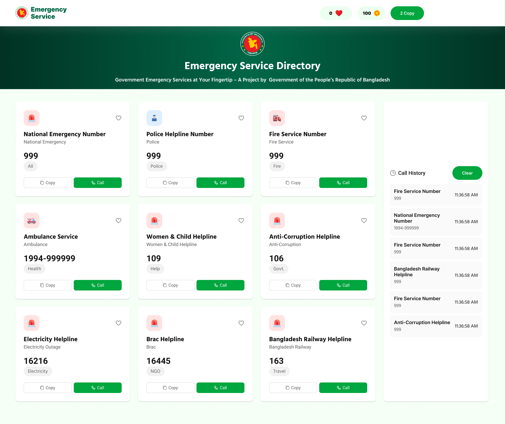

# 🚨 Emergency Service Directory


An **interactive web application** that provides a directory of **emergency hotline numbers in Bangladesh**.
It allows users to **copy, like, and simulate calls** to emergency services while tracking interactions via a **coin-based system**.

🔗 **Live Demo:** [Click Here](https://shahidulislam-cse.github.io/joruri-seba-bd/)

---

## ✨ Features

* 📞 **Emergency Services Directory** – 9 essential hotlines with service name, number & category.
* 📋 **Copy Numbers** – One-click copy to clipboard, tracked in the navbar.
* 📱 **Simulated Calls** –

  * Calls cost **20 coins** (default balance: 100).
  * Alerts simulate real calls.
  * Prevents calls if balance is insufficient.
* 🕑 **Call History** – Logs service, number & exact time of each call. History can be cleared.
* ❤️ **User Interactions** – Navbar shows:

  * Total likes ❤️
  * Remaining coins 🪙
  * Numbers copied 📋
* 📲 **Responsive UI** – Works smoothly on desktop, tablet & mobile.

---

## ⚙️ Tech Stack

* **HTML5** – Structure
* **CSS3** – Styling & animations
* **Tailwind CSS** – Utility-first framework
* **DaisyUI** – Prebuilt UI components
* **JavaScript (ES6+)** – Logic, DOM, and interactions

---

## 🚀 Getting Started

Run this project locally in 3 simple steps:

```bash
# 1. Clone the repo

Github link: 
git clone https://github.com/shahidulislam-cse/joruri-seba-bd.git

# 2. Go into the project folder
cd joruri-seba-bd

# 3. Open index.html in a browser
```

That’s it 🎉 – no build tools required!

---

# 📘 JavaScript Questions & Answers

This document provides clear explanations and **practical code examples** for common JavaScript interview and learning questions.

---

## 1. Difference between `getElementById`, `getElementsByClassName`, and `querySelector` / `querySelectorAll`

| Method                            | Selects by       | Returns                          | Notes                         |
| --------------------------------- | ---------------- | -------------------------------- | ----------------------------- |
| `getElementById("id")`            | **ID**           | One element or `null`            | Fastest, unique               |
| `getElementsByClassName("class")` | **Class**        | Live HTMLCollection (array-like) | Updates automatically         |
| `querySelector("css")`            | **CSS selector** | First matching element           | Very flexible                 |
| `querySelectorAll("css")`         | **CSS selector** | Static NodeList                  | Snapshot, doesn’t auto-update |

**Example:**

```html
<div id="title">Hello ID</div>
<div class="item">Class 1</div>
<div class="item">Class 2</div>
<p>Paragraph 1</p>
<p>Paragraph 2</p>
```

```js
// Select by ID
const title = document.getElementById("title");
console.log(title.textContent); // "Hello ID"

// Select by class (HTMLCollection)
const items = document.getElementsByClassName("item");
console.log(items[0].textContent); // "Class 1"

// Select first element with CSS selector
const firstParagraph = document.querySelector("p");
console.log(firstParagraph.textContent); // "Paragraph 1"

// Select all elements (NodeList)
const allParagraphs = document.querySelectorAll("p");
allParagraphs.forEach(p => console.log(p.textContent));
// Logs: "Paragraph 1", "Paragraph 2"
```

---

## 2. How do you Create and Insert a New Element into the DOM?

Steps:

1. Create a new element.
2. Add content or attributes.
3. Insert it into a parent element.

**Example:**

```html
<div id="container"></div>
```

```js
// Step 1: Create a new <div>
const newDiv = document.createElement("div");

// Step 2: Add content and class
newDiv.textContent = "Hello, World!";
newDiv.classList.add("box");

// Step 3: Insert into parent
document.getElementById("container").appendChild(newDiv);
```

✅ Result: A new `<div>` with text "Hello, World!" appears inside `#container`.

---

## 3. What is Event Bubbling and How Does It Work?

* **Event Bubbling** is when an event starts at the **target element** and then **bubbles up** through parent elements until it reaches `<html>` and `window`.

**Example:**

```html
<div id="parent">
  <button id="child">Click Me</button>
</div>
```

```js
document.getElementById("child").addEventListener("click", () => {
  console.log("Child button clicked!");
});

document.getElementById("parent").addEventListener("click", () => {
  console.log("Parent div clicked!");
});

document.body.addEventListener("click", () => {
  console.log("Body clicked!");
});
```

✅ Clicking the button will log:

* `"Child button clicked!"`
* `"Parent div clicked!"`
* `"Body clicked!"`

---

## 4. What is Event Delegation in JavaScript? Why is it Useful?

* **Event Delegation** is when you add **one event listener to a parent element** and let it handle events from all of its child elements.
* It works because of **event bubbling**.

✅ **Why useful?**

* Saves memory (fewer listeners).
* Works for dynamically added elements.
* Cleaner and simpler code.

**Example:**

```html
<ul id="myList">
  <li>Item 1</li>
  <li>Item 2</li>
  <li>Item 3</li>
</ul>
```

```js
// Add one listener to the parent <ul>
document.getElementById("myList").addEventListener("click", (e) => {
  if (e.target.tagName === "LI") {
    console.log("Clicked on:", e.target.textContent);
  }
});
```

✅ Clicking any `<li>` will log its text — even if new items are added later.

---

## 5. What is the Difference between `preventDefault()` and `stopPropagation()`?

| Method                    | Stops...               | Example                                                      |
| ------------------------- | ---------------------- | ------------------------------------------------------------ |
| `event.preventDefault()`  | Default browser action | Prevent a form from submitting / stop a link from navigating |
| `event.stopPropagation()` | Event bubbling upward  | Prevent parent’s event from firing                           |

**Example:**

```html
<a href="https://google.com" id="myLink">Go to Google</a>

<div id="outer">
  <button id="inner">Click Me</button>
</div>
```

```js
// preventDefault example
document.getElementById("myLink").addEventListener("click", (e) => {
  e.preventDefault(); // Stops opening Google
  console.log("Default action prevented!");
});

// stopPropagation example
document.getElementById("inner").addEventListener("click", (e) => {
  e.stopPropagation(); // Stops bubbling to parent
  console.log("Button clicked!");
});

document.getElementById("outer").addEventListener("click", () => {
  console.log("Outer div clicked!");
});
```

✅ Results:

* Clicking the **link** logs `"Default action prevented!"` (doesn’t open Google).
* Clicking the **button** logs `"Button clicked!"` but not `"Outer div clicked!"`.

---


## 📸 Screenshots





---

## 🤝 Contributing

Contributions are welcome!

* Fork the repo
* Create a feature branch
* Submit a Pull Request 🎉

---

## 📜 License

Licensed under the **MIT License** – free to use, modify, and distribute.

---
